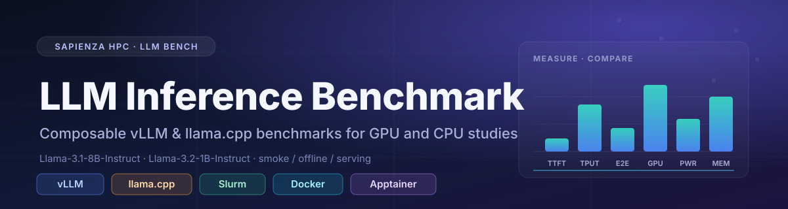

<div align="center">



</div>

<p align="center">
  <a href="https://www.python.org/"></a>
  <a href="https://docs.vllm.ai/"></a>
  <a href="https://github.com/ggml-org/llama.cpp"></a>
  <a href="https://slurm.schedmd.com/"></a>
  <a href="https://www.docker.com/"></a>
  <a href="https://apptainer.org/"></a>
  <a href="https://www.streamlit.io/"></a>
</p>

<p align="center">
  
  
  
</p>

A composable inference-system benchmark that drives the **same Llama models and
workloads** through either [vLLM](https://docs.vllm.ai/) or
[llama.cpp](https://github.com/ggml-org/llama.cpp), on **GPU or CPU**, natively or in
containers. It measures inference-system behavior — latency, throughput, utilization,
power, and energy — not model quality. It is not an official MLPerf implementation.

**Models:** `meta-llama/Llama-3.1-8B-Instruct` · `meta-llama/Llama-3.2-1B-Instruct`
**Workloads:** smoke · offline · serving

---

## Quick start on a cluster

The shortest path to a first benchmark run. Step-by-step discovery and background
for every command live in [the documentation](#documentation).

### 1. Configure the cluster

Clone the repository and create a private copy of the example environment file:

```bash
git clone <REPOSITORY_URL> benchmark
cd benchmark
cp configs/cluster/sapienza.example.env configs/cluster/sapienza.env
```

Edit `configs/cluster/sapienza.env` and replace every `<PLACEHOLDER>` with values
discovered on your site: the compatible Python, absolute paths for the checkout,
virtualenv, Hugging Face cache, artifact root, and results root. Never put `HF_TOKEN`
in this file.

### 2. Install the runner

```bash
bash scripts/create_venv.sh --config configs/cluster/sapienza.env
source configs/cluster/sapienza.env
source "${VENV_PATH}/bin/activate"
```

Backend runtimes are installed independently: a vLLM build matching your CUDA stack,
or llama.cpp binaries with `LLAMA_CPP_BIN_DIR` set. See
[Environment and model setup](docs/02_ENVIRONMENT_AND_MODEL_SETUP.md) for details.

### 3. Prepare a sample model

Resolving the Hugging Face snapshot outside the timed job pins an immutable revision
and, for llama.cpp, produces GGUF artifacts:

```bash
llm-bench prepare-model \
  --model configs/models/llama32_1b.yaml \
  --provider native \
  --variants f16,q8_0,q4_k_m \
  --artifact-root "$MODEL_ARTIFACT_ROOT" \
  --cache-root "$MODEL_CACHE_DIR"
```

### 4. Validate the composition

Confirm the model, workload, profile, provider, and variant form a valid, supported
combination before any timed work:

```bash
llm-bench preflight \
  --model configs/models/llama32_1b.yaml \
  --workload configs/workloads/smoke.yaml \
  --profile configs/profiles/vllm_gpu.yaml \
  --provider native --variant f16 \
  --artifact-root "$MODEL_ARTIFACT_ROOT"
```

### 5. Run a sample benchmark

Dry-run to inspect the exact command, then execute:

```bash
bash scripts/run_benchmark.sh \
  --config configs/cluster/sapienza.env \
  --model configs/models/llama32_1b.yaml \
  --workload configs/workloads/smoke.yaml \
  --profile configs/profiles/llamacpp_cpu.yaml \
  --provider native --variant f16 \
  --dry-run

bash scripts/run_benchmark.sh \
  --config configs/cluster/sapienza.env \
  --model configs/models/llama32_1b.yaml \
  --workload configs/workloads/smoke.yaml \
  --profile configs/profiles/llamacpp_cpu.yaml \
  --provider native --variant f16
```

On Slurm, pass site resources to `sbatch`; the repository never guesses them:

```bash
sbatch <SITE_RESOURCE_OPTIONS> \
  --export=ALL,BENCH_CONFIG="$PWD/configs/cluster/sapienza.env",MODEL_CONFIG="$PWD/configs/models/llama32_1b.yaml",WORKLOAD_CONFIG="$PWD/configs/workloads/smoke.yaml",PROFILE_CONFIG="$PWD/configs/profiles/llamacpp_cuda.yaml",BENCH_PROVIDER=apptainer,MODEL_VARIANT=f16 \
  slurm/benchmark.sbatch
```

### 6. Where results land

Each run writes a self-contained directory under `$RESULTS_ROOT` with
`resolved_experiment.yaml`, `metadata.json`, `summary.json` (schema 2.0),
`measurements.json`, raw backend output, telemetry CSV, and logs. Compare runs and
explore the interactive dashboard:

```bash
llm-bench compare RUN_A RUN_B --output-dir COMPARISON_DIRECTORY
llm-bench dashboard --results-root "$RESULTS_ROOT"
```

---

## Architecture

Experiments are composed at the CLI from four orthogonal inputs; changing a model or
workload is a config-only change:

| Input | Purpose | Example |
| --- | --- | --- |
| `--model` | Canonical HF identity, revision policy, per-backend artifact variants | `configs/models/llama32_1b.yaml` |
| `--workload` | Smoke / offline / serving request shapes and controls | `configs/workloads/smoke.yaml` |
| `--profile` | vLLM GPU or llama.cpp CPU/CUDA placement | `configs/profiles/vllm_gpu.yaml` |
| `--provider` | `native` · `docker` · `apptainer` | `--provider native` |

`f16` is available to both backends; `q8_0` and `q4_k_m` are llama.cpp-only. Smoke and
serving runs share one OpenAI-compatible streaming client; offline runs keep the native
tools (`vllm bench throughput`, `llama-bench`), whose measurement scopes differ, so
cross-backend offline results are descriptive, never controlled ratios.

## Documentation

Start at [docs/](docs/README.md) — the documentation index.

- [01 — Cluster prerequisites](docs/01_CLUSTER_PREREQUISITES.md)
- [02 — Environment, providers, and model preparation](docs/02_ENVIRONMENT_AND_MODEL_SETUP.md)
- [03 — Running the benchmark matrix](docs/03_RUNNING_THE_BENCHMARKS.md)
- [04 — Metrics, results, and comparison validity](docs/04_METRICS_AND_RESULTS.md)
- [05 — CPU-HBM roadmap](docs/05_CPU_HBM_ROADMAP.md)

## Repository layout

- `configs/` — cluster env example, model manifests, workloads, profiles
- `src/llm_bench/` — configuration, providers, backends, runner, results, dashboard
- `scripts/` — environment setup, preflight, generic run entry point
- `slurm/` — portable Slurm job entry point
- `assets/` — banner and brand assets
- `docs/` — the full documentation
- `results/` — ignored run output (only `.gitkeep` is tracked)